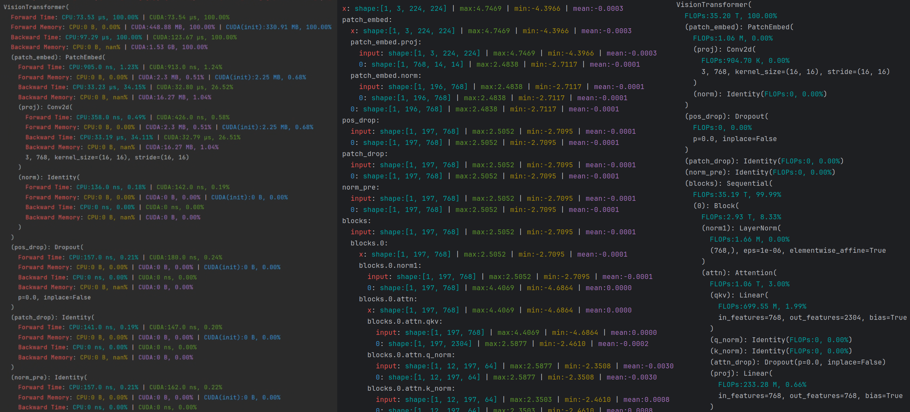

# Torch Analyzer

This tool can be used to analyze the model run time, GPU memory usage, input/output information of each layer, and FLOPs of each layer in PyTorch models.

The run time, GPU memory usage, and FLOPs are analyzed at the **cuda operator level**, which is more accurate than the existing module-based analysis. Even model with custom operators can be analyzed.



## Installation
Install from pip:
```bash
pip install torch-analyzer
```

Install from source:
```bash
git clone https://github.com/IrisRainbowNeko/torch-analyzer.git
cd torch-analyzer
pip install -e .
```

## Usage
Example:
```python
import torch
import torchvision.models as models
from torchanalyzer import ModelTimeMemAnalyzer, TorchViser

model = models.resnet18().cuda()
inputs = torch.randn(1, 3, 224, 224).cuda()

analyzer = ModelTimeMemAnalyzer(model)
info = analyzer.analyze(inputs)
TorchViser().show(model, info)
```

### Analyze model
Analyze run time of each layer:
```python
from torchanalyzer import ModelTimeMemAnalyzer

analyzer = ModelTimeMemAnalyzer(model)
info = analyzer.analyze(inputs)
```

Analyze input/output information of each layer:
```python
from torchanalyzer import ModelIOAnalyzer

analyzer = ModelIOAnalyzer(model)
info = analyzer.analyze(inputs)
```

Analyze flops of each layer:
```python
from torchanalyzer import ModelFlopsAnalyzer

analyzer = ModelFlopsAnalyzer(model)
info = analyzer.analyze(inputs)
```

### Show Analyzed Information
Show with the style like `print(model)` in torch:
```python
from torchanalyzer import TorchViser
TorchViser().show(model, info)
```

Show with table style:
```python
from torchanalyzer import TableViser
TableViser().show(model, info)
```

Show with flow style:
```python
from torchanalyzer import FlowViser
FlowViser().show(model, info)
```

### Backward Analyze
Analyze run time and memory of each layer in backward:
```python
from torchanalyzer import ModelTimeMemAnalyzer

analyzer = ModelTimeMemAnalyzer(model)
info = analyzer.analyze(inputs, with_backward=True)
```